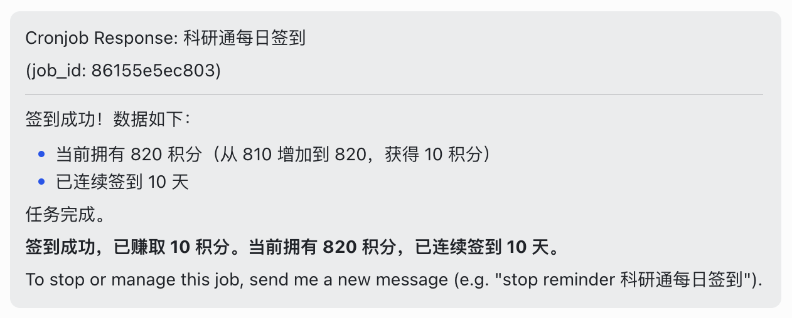

# 科研通 (ablesci.com) Skills

两个面向[科研通](https://www.ablesci.com/)的自动化 Skill，分别用于**每日签到**和**文献下载**。

## Skill 概览

| Skill | 用途 |
|-------|------|
| [ablesci-daily-checkin](ablesci-daily-checkin/SKILL.md) | 科研通每日自动签到 |
| [download-pdf](download-pdf/SKILL.md) | 根据 DOI 下载文献 PDF，优先本地脚本，失败则通过科研通求助补救 |

---

## ablesci-daily-checkin

每天自动访问科研通并执行签到操作。

### 前置准备

需要配置两个环境变量用于登录：

| 变量名 | 说明 |
|--------|------|
| `ABLESCI_EMAIL` | 科研通登录邮箱 |
| `ABLESCI_PASSWORD` | 科研通登录密码 |

#### 配置方法

将以下提示语发给 AI Agent（如 Claude Code）完成配置：

> 请帮我把以下两个环境变量设置为全局可访问：
>
> - `ABLESCI_EMAIL` = `your_email@example.com`
> - `ABLESCI_PASSWORD` = `your_password`
>
> 我的操作系统是 macOS，请将这两个变量写入 `~/.zshrc`，确保：
> 1. 写入格式为 `export ABLESCI_EMAIL="your_email@example.com"` 和 `export ABLESCI_PASSWORD="your_password"`
> 2. 写入后执行 `source ~/.zshrc` 使其立即生效
> 3. 用 `echo $ABLESCI_EMAIL` 验证变量已正确设置

也可以手动配置，在 `~/.zshrc`（或对应 shell 配置文件）中添加：

```bash
export ABLESCI_EMAIL="your_email@example.com"
export ABLESCI_PASSWORD="your_password"
```

### 使用方式

```
/ablesci-daily-checkin
```

建议配合 cron 定时任务每天早上 9:00 自动执行。

### 效果截图



---

## download-pdf

根据给定的 DOI 获取文献 PDF。

### 执行流程

1. 优先调用本地 `PDF_downloader.py` 脚本下载
2. 若本地下载失败（`PDFs/Failed.txt` 中出现该 DOI），则通过科研通"发布文献求助"获取
3. 下载成功后，将 PDF 移动到 `~/Documents/PDFs/`
4. 若超过 24 小时仍未获取到文献，通知用户科研通已自动关闭求助

### 使用方式

```
/download-pdf <DOI>
```

### 依赖

- `PDF_downloader.py` 脚本
- `PDFs/` 输出目录
- 科研通登录态（由浏览器或脚本管理）

---

## 目录结构

```
Skills/
├── README.md                        ← 本文件
├── ablesci-daily-checkin/
│   ├── SKILL.md                     ← Skill 定义文件
│   └── skill效果.png                 ← 签到效果截图
└── download-pdf/
    └── SKILL.md                     ← Skill 定义文件
```
